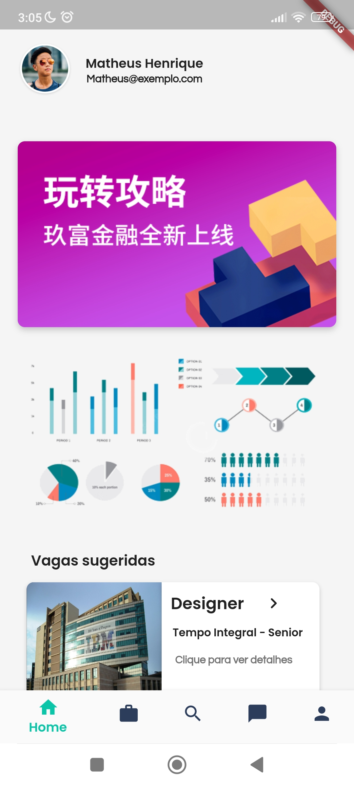

# Jobzilla

O presente projeto consiste em desenvolver um aplicativo na linguagem flutter, que inclui técnicas de inteligência artificial para selecionar automaticamente o candidato que se encaixa melhor com a oportunidade de emprego em questão. Para o desenvolvimento da aplicação, com o objetivo de ter um projeto mais limpo, organizado e fácil de receber manutenção, foram implementados alguns recursos como arquitetura limpa (Clean Architecture) e padrão de projeto MVVMu (Usecase).

Você pode ler o artigo completo em: <a href="https://github.com/Matheus872/Jobzilla/blob/master/Artigo/Artigo.pdf">Artigo</a>

 

## Languages and resources

- App -> Flutter with MVVMu project pattern;
- Backend -> Java REST API with SpringBoot;
- Base de dados -> PostgreSQL.

## Back-End

### Project patterns:
 - REST;
 - MVC;
 - DAO;
 - SOLID;
 - Repository.

### Frameworks

- Enviroment: SpringBoot;
- Security: SpringSecurity ;
- Data persistence: JPA, Hibernate;
- Readability: Lombock.

## Themes

     

## User Interface

<h3>Onboarding - Login - Email verification with PIN code </h3>
 

        
        
     

 <h3>Homepage - Jobs page - Explore page - Configurations page</h3>

     
     
     
     
     

## Google Maps API Consumption

     
     
 

## User Experience Features

Field Validation
  

  
Password Protector 
     
  
   
ScrollView, MediaQuery and languages with i18n library 
  
  

## Other Features
- User autentication with JWT token;
- Chatbot with Dialog Flow.
